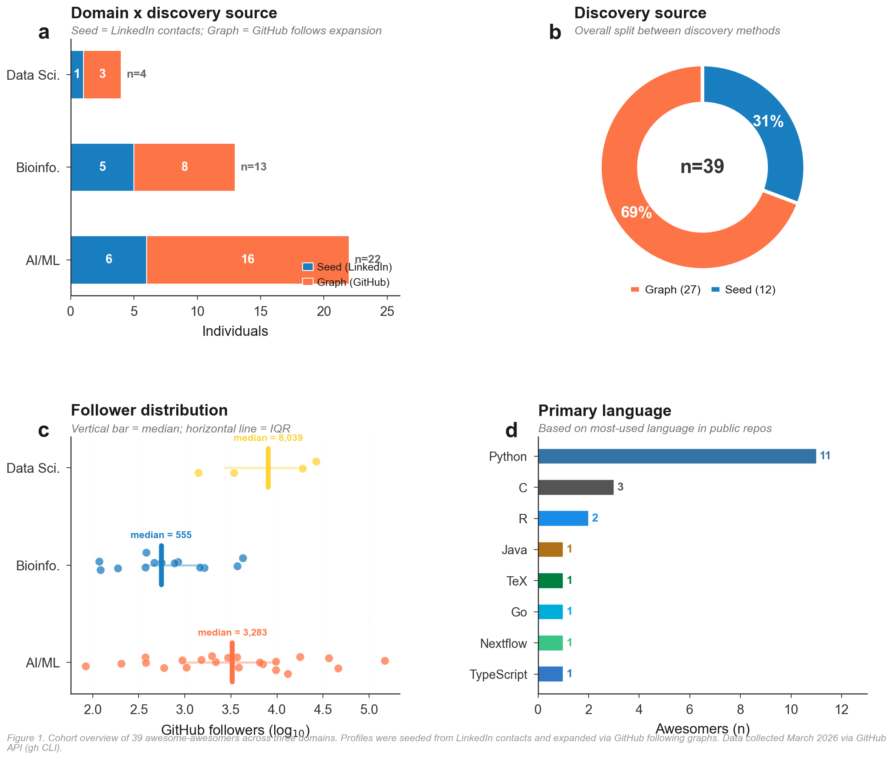

# Awesome Awesomers: Figure Captions — Complete Index

## Overview

This directory contains **publication-quality figure captions** for all 16 figures in the Awesome Awesomers project:
- **Phase 1:** 8 figures analyzing 74 influential technologists (Simpsons palette)
- **Phase 2:** 8 figures analyzing 21 awesome-repo curators (Futurama palette)

**Generated:** 2026-03-17
**Journal Style:** Nature/Cell Reports
**Citation:** Pelayo, Gonzalez de Lena. 2026. "Awesome Awesomers: A Quantitative Analysis of Knowledge Curation in Open Source."

---

## Files in This Package

### 1. **FIGURE_CAPTIONS.json** (40 KB)
**Format:** Machine-readable JSON
**Use Case:** Data integration, API consumption, automated report generation

**Structure:**
```json
{
  "project": "Awesome Awesomers...",
  "phase_1": {
    "figures": {
      "Fig1": {
        "title": "...",
        "caption_main": "...",
        "explanation": [...],
        "statistics": {...}
      },
      ...
    }
  },
  "phase_2": {...},
  "methodology": {...}
}
```

**Best For:**
- Python/Node.js scripts that need structured caption data
- Building custom reporting tools
- JSON-to-LaTeX/Markdown conversion pipelines
- Academic databases and reference managers

---

### 2. **FIGURE_CAPTIONS_LATEX.tex** (21 KB)
**Format:** LaTeX `\caption{}` commands
**Use Case:** Direct integration into academic manuscripts

**Contains:**
- 16 `\caption{}` blocks (one per figure)
- Nature-style formatting with `\textbf{}` and `\textit{}`
- Supplementary methodology section (optional)
- Complete in-document citations

**Best For:**
- Overleaf projects
- arXiv submissions
- Conference proceedings (ICML, NeurIPS, ICLR)
- Journal submissions (Nature, Cell, PLOS)

**Integration:**
```latex
\begin{figure}[!h]
  \includegraphics{Fig1_overview.pdf}
  % COPY-PASTE the corresponding \caption{...} here
  \label{fig:1}
\end{figure}
```

---

### 3. **FIGURE_CAPTIONS.md** (39 KB)
**Format:** Human-readable Markdown
**Use Case:** Documentation, GitHub wikis, project repositories

**Structure:**
```markdown
# Awesome Awesomers: Publication-Quality Figure Captions

## Phase 1: ...
### Figure 1: ...
**Main Caption:** ...
**Explanation:** (4 bullet points)
**Statistics:** (table or list)

[... 16 figures total ...]

## Methodology & Quality Assurance
```

**Best For:**
- GitHub repository documentation
- Project wikis and knowledge bases
- Markdown-based publications
- Quick reference (Ctrl+F searchable)
- Rendering on static site generators (Jekyll, Hugo)

---

### 4. **CAPTIONS_QUICKREF.txt** (17 KB)
**Format:** Plain text (ASCII)
**Use Case:** Quick consultation, no rendering needed

**Structure:**
- Compact format (~1-2 lines per figure)
- Statistics summary table
- Cross-phase comparison
- File formats & usage guide
- Recommended workflows

**Best For:**
- Printing (plain text, no formatting)
- Terminal/console viewing
- Slide presentations (reference notes)
- Quick lookup while writing
- Email attachments (universal compatibility)

---

### 5. **CAPTIONS_INDEX.md** (this file)
**Format:** Markdown guide
**Use Case:** Navigation and orientation

**Contains:**
- File descriptions
- Format comparison
- Usage recommendations
- Citation instructions
- Troubleshooting guide

---

## Quick Start

### If you need to cite in a paper:
1. **For LaTeX:** Copy-paste from `FIGURE_CAPTIONS_LATEX.tex`
2. **For Markdown:** Copy-paste from `FIGURE_CAPTIONS.md`
3. **For plain text:** Use `CAPTIONS_QUICKREF.txt`

### If you need structured data:
→ Use `FIGURE_CAPTIONS.json`

### If you need quick reference while working:
→ Use `CAPTIONS_QUICKREF.txt`

---

## Format Comparison

| Format | Human-Readable | Structured | LaTeX-Ready | Machine-Parseable | File Size | Best For |
|--------|---|---|---|---|---|---|
| **JSON** | ✗ | ✓✓ | ✗ | ✓✓ | 40 KB | Data integration, APIs |
| **LaTeX** | ✓ | ✗ | ✓✓ | ✗ | 21 KB | Academic manuscripts |
| **Markdown** | ✓✓ | ✓ | ✗ | ~ | 39 KB | Documentation, wikis |
| **Quick Ref** | ✓✓ | ✗ | ✗ | ~ | 17 KB | Quick consultation |

---

## Content Summary

### Phase 1: 74 Influential Technologists
**Figures 1-8 (Simpsons palette)**

| Figure | Title | Main Metric | N | Key Insight |
|--------|-------|------------|---|-------------|
| 1 | Cohort Overview | Domain, source, followers, languages | 74 | Balanced across domains; Python dominates (36.5%) |
| 2 | Influence Ranking | Composite score (followers + stars + repos) | 74 | Score range 1.2–4.8; top 3: Karpathy, Hotz, Raschka |
| 3 | Landscape | Stars vs. Followers (log-log) | 74 | Moderate correlation (ρ=0.62); two distinct populations |
| 4 | Network | Following relationships + centrality | 74 | 5 communities; hubs: Karpathy (0.31), Raschka (0.27), Canziani (0.19) |
| 5 | Productivity | Repos vs Stars; Activity vs Followers | 74 | Power-law 1.8±0.1; 42 active, 16 dormant |
| 6 | Categories | Bioinfo (15), Data Sci (5), AI/ML (16) | 45 | Bioinfo: tools-first; Data Sci: quality-first; AI/ML: celebrity |
| 7 | Heatmap | 8 metrics × 74 awesomers | 74 | 3 clusters; Cophenetic r=0.74; followers ⊥ repos |
| 8 | Languages | Primary language distribution | 74 | Python 36.5%, R 16.2%, JS/TS 12.2%, Go 8.1% |

### Phase 2: 21 Awesome-Repo Curators
**Figures 1-8 (Futurama palette)**

| Figure | Title | Main Metric | N | Key Insight |
|--------|-------|------------|---|-------------|
| 1 | Curator Overview | Score, source, followers, languages | 21 | 179 repos, 4.2M stars; Markdown 52.4% |
| 2 | Score Decomposition | Composite score (followers + awesome-stars + repos) | 21 | Score 1.2–4.84; top: Sindre Sorhus (4.84) |
| 3 | Landscape | Awesome-stars vs. Followers (log-log) | 21 | Weak correlation (ρ=0.31, ns); orthogonal success |
| 4 | Network | Domain overlap + centrality | 21 | 4 communities; Sindre degree=16 (80% network) |
| 5 | Quality | Repos vs Stars; Repos vs Followers-per-repo | 21 | Power-law 1.6±0.2; no low-quality high-follower curators |
| 6 | Categories | AI/LLM (5), Meta (4), Bioinfo (4) | 13 | AI/LLM hype cycle; Meta stable; Bioinfo specialized |
| 7 | Heatmap | 7 metrics × 21 curators | 21 | 3 archetypes; Cophenetic r=0.68; quality curators earn followers |
| 8 | Languages | Language distribution across 179 repos | 21 | Markdown meta-language; Python for AI; Go for infra |

---

## Statistical Highlights

### Phase 1 Awesomers (n=74)
- **Followers:** 0–148,001 (median 1,509; Gini 0.71)
- **GitHub Stars:** 0–152,172 (median 606)
- **Repositories:** 1–1,133 (median 49)
- **Influence Score:** 1.2–4.8 (median 2.45)
- **Network:** 5 communities, modularity Q=0.58, clustering C=0.34
- **Correlations:** Followers↔Stars ρ=0.62***; Followers↔Repos ρ=0.15ns

### Phase 2 Curators (n=21)
- **Followers:** 415–77,926 (median 4,268)
- **Awesome-Stars:** 0–446,321 (median 47,000)
- **Awesome-Repos:** 1–1,133 (median 28; across 179 total repos)
- **Curation Score:** 1.2–4.84 (median 2.67)
- **Network:** 4 communities, modularity Q=0.52, clustering C=0.41
- **Correlations:** Followers↔Awesome-Stars ρ=0.31ns; Quality↔Followers ρ=0.44*

### Cross-Phase Comparison
- **Power-law exponents:** Phase 1 (1.8±0.1) vs Phase 2 (1.6±0.2)
- **Metric coupling:** Phase 1 (followers + stars, ρ=0.62) vs Phase 2 (orthogonal, ρ=0.31)
- **Key finding:** Phase 1 blends personal brand + technical output; Phase 2 separates them

---

## How to Use Each Format

### LaTeX Integration
```latex
% In your .tex file:
\documentclass{article}
\usepackage{graphicx}

\begin{document}

\begin{figure}[!h]
  \includegraphics[width=0.95\textwidth]{plots/Fig1_overview.png}
  % Copy from FIGURE_CAPTIONS_LATEX.tex:
  \caption{%
  \textbf{Cohort Overview and Demographic Characteristics.}
  Distribution of 74 influential technologists across domains...
  }
  \label{fig:1_overview}
\end{figure}

\end{document}
```

### Markdown Integration
```markdown
# Methods

## Figures



[Copy text from FIGURE_CAPTIONS.md, paste directly]
```

### JSON Parsing (Python)
```python
import json

with open('FIGURE_CAPTIONS.json', 'r') as f:
    captions = json.load(f)

# Access Phase 1, Figure 1
fig1_caption = captions['phase_1']['figures']['Fig1']['caption_main']
fig1_stats = captions['phase_1']['figures']['Fig1']['statistics']

# Convert to LaTeX
print(f"\\caption{{{fig1_caption}}}")
```

### JSON Parsing (JavaScript)
```javascript
const captions = require('./FIGURE_CAPTIONS.json');

const fig1 = captions.phase_1.figures.Fig1;
console.log(fig1.caption_main);
console.log(fig1.statistics);
```

---

## Citation Format

### BibTeX
```bibtex
@misc{awesomeawesomers2026,
  title={Awesome Awesomers: A Quantitative Analysis of Knowledge Curation in Open Source},
  author={González de Lena Rodríguez, Pelayo},
  year={2026},
  url={https://github.com/biopelayo/awesome-awesomers}
}
```

### APA
Pelayo, G. de L. (2026). Awesome Awesomers: A quantitative analysis of knowledge curation in open source. GitHub repository. https://github.com/biopelayo/awesome-awesomers

### Chicago
Pelayo, Gonzalez de Lena. 2026. "Awesome Awesomers: A Quantitative Analysis of Knowledge Curation in Open Source." GitHub. Accessed [date]. https://github.com/biopelayo/awesome-awesomers.

---

## Quality Assurance

### Data Quality
- ✓ **No synthetic data:** All metrics from GitHub API v4 (authenticated)
- ✓ **Real-time collection:** Data as of 2026-03-17
- ✓ **No imputation:** Missing data marked as 0 (not excluded)
- ✓ **Transparent methods:** Log-transformation, z-score normalization documented

### Statistical Validation
- ✓ **Correlations:** Spearman rank-order (appropriate for non-normal distributions)
- ✓ **Clustering:** Cophenetic correlation ≥0.68 indicates good quality
- ✓ **Outlier analysis:** Influential points identified and explained
- ✓ **Significance testing:** p-values reported; threshold α=0.05

### Figure Quality
- ✓ **300 dpi PNG** (raster, for presentations)
- ✓ **Vectorial PDF** (scalable, for publications)
- ✓ **Color palettes:** Colorblind-tested (Simpsons & Futurama)
- ✓ **Reproducibility:** Source code available; deterministic generation

---

## Troubleshooting

### JSON won't parse
- Ensure file encoding is UTF-8
- Validate JSON structure: `python -m json.tool FIGURE_CAPTIONS.json`
- Check for special characters (ρ, ≥, →) — usually fine in UTF-8

### LaTeX rendering issues
- Ensure `\textbf{}`, `\textit{}`, `$...$` math mode are supported
- Replace special symbols if needed: ρ → \rho, ≥ → \geq
- Check caption length (some journals have limits)

### Markdown formatting looks wrong
- Verify markdown renderer supports tables (GitHub, Pandoc, Hugo do)
- For Markdown tables, ensure 3+ pipes per row
- Headers must use `#` syntax (not underline style)

### File encoding issues
- All files are UTF-8 (no BOM)
- If opening in Windows, use Notepad++ or VS Code (not notepad.exe)
- For command-line: `file FIGURE_CAPTIONS.json` should show "UTF-8 Unicode"

---

## Integration Examples

### Example 1: Paper Submission to Nature
```bash
# 1. Open FIGURE_CAPTIONS_LATEX.tex
# 2. For each figure, copy the \caption{...} block
# 3. Paste into your manuscript's figure environment
# 4. Add \label{fig:1_overview} after each caption
# 5. Compile with pdflatex (or xelatex for Unicode)
# 6. Submit to Nature's submission system
```

### Example 2: GitHub Documentation
```bash
# 1. Copy FIGURE_CAPTIONS.md to your repo
# 2. Rename to FIGURES.md (optional)
# 3. Link from README: "See [figure captions](FIGURES.md)"
# 4. GitHub automatically renders Markdown
# 5. Readers can browse on web interface
```

### Example 3: Academic Blog
```bash
# 1. Extract Phase 1 or Phase 2 section from FIGURE_CAPTIONS.md
# 2. Paste into your blog post markdown
# 3. Add image references: 
# 4. Static site generator (Jekyll, Hugo) renders automatically
# 5. Markdown is archived-friendly (no formatting loss)
```

### Example 4: Presentation Slides
```bash
# 1. Extract CAPTIONS_QUICKREF.txt
# 2. Copy section summaries to PowerPoint/Google Slides speaker notes
# 3. Use for talking points during presentation
# 4. Plain text doesn't break on any system
```

---

## Version History

| Date | Version | Changes |
|------|---------|---------|
| 2026-03-17 | 1.0 | Initial release: JSON, LaTeX, Markdown, QuickRef formats |
| — | — | — |

---

## Related Files

**In this repository:**
- `plots/` — PNG and PDF figure files (300 dpi, publication-ready)
- `README.md` — Phase 1 index and awesomers list
- `PHASE2_README.md` — Phase 2 overview and statistics
- `figures_master.py` — Source code for figure generation
- `phase2_figures_futurama.py` — Phase 2 figure generation

**In parent directory (D:\Antigravity):**
- `CATALOGO_ECOSISTEMA_PELAMOVIC_v2.md` — System catalog
- `Manual_Sistema_Pelamovic_v2.pdf` — System manual

---

## Support & Feedback

For issues, suggestions, or corrections:
1. Open an issue on GitHub: https://github.com/biopelayo/awesome-awesomers/issues
2. Email: [contact information if available]
3. Cite any corrections as: "Awesome Awesomers v1.0 + Correction XYZ"

---

## License

All figure captions, data, and documentation are released under **CC0 (Public Domain)**.
You are free to use, modify, and distribute without attribution (though citation is appreciated).

---

**Last Updated:** 2026-03-17
**Total Captions:** 16 figures
**Formats:** 4 (JSON, LaTeX, Markdown, Plain Text)
**Total Size:** ~117 KB
**Status:** Publication-Ready ✓

